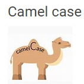

# Bienvenidos
En el siguiente repositorio encontraremos una variedad de topicos acerca de la materia Ingeniería de Software 
de la carrera de Ingeniería en Sistemas dicatada por la Universidad Tecnológica Nacional Facultad Regional de Cordoba.

## Objetivo
La finalidad del mismo es la de:
    - Acercar al grupo a las herramientas para llevar a cabo el control de versiones sobre los archivos subidos
    - Diseñar la estructura del repositorio
    - Implementar la misma para resguardar el trabajo generado durante el cursado de la materia.
    - Definir lineas base del proyecto

## Estructura del Repositorio 

## Nomenclatura general

## Linea Base 
   Como grupo definimos que la LINEA BASE será todos los Martes después de la clase Practica (ya que por lo general se nos notifica el próximo TP a desarrollar) y los días Viernes al finalizar la clase Teórica.

## Integrantes
    - Federico Carabelli
    - Alex Cerutti
    - Andres Claro Cordoba
    - Lucas Diaz
    - Nicolas de la Cruz
    - Juan Rivero

Para consultar el contenido, no es necesario disponer de una cuenta en Github, sin embargo, si se requiere de una para proponer cambios.
