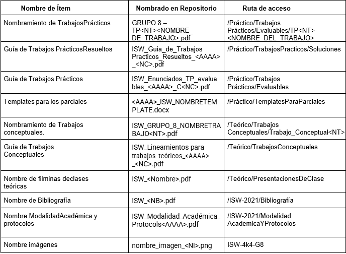

## Grupo N° 8 - TP N° 4 - U.T.N. F.R.C. 

# Bienvenidos
En el siguiente repositorio encontraremos una variedad de topicos acerca de la materia Ingeniería de Software 
de la carrera de Ingeniería en Sistemas dicatada por la Universidad Tecnológica Nacional Facultad Regional de Cordoba.

## Objetivo
La finalidad del mismo es la de:
    - Acercar al grupo a las herramientas para llevar a cabo el control de versiones sobre los archivos subidos
    - Diseñar la estructura del repositorio
    - Implementar la misma para resguardar el trabajo generado durante el cursado de la materia.
    - Definir lineas base del proyecto

## Estructura del Repositorio 

## Nomenclatura general

## Items de configuracion

## Linea Base 
   Como grupo definimos que la LINEA BASE será el viernes siguiente a cada parcial.

## Integrantes
    - Federico Carabelli
    - Alex Cerutti
    - Lucas Diaz
    - Juan Rivero
 ##Prueba
 Estructura de repositorio de la materia ISW
ISW-4K4-G8
|	README.md
|	sreenshot1.png
|	sreenshot2.png
|	sreenshot3.png
|	ISW-2021
|	Bibliografía
|	ModalidadAcademicaYProtocolos
	Practico
I	TemplatesParaParciales
       			       | ------ 2020_ISW_Segundo_Parcial_Template.dotx
       | ------ 2021_ISW_TemplateParcial1.docx
                                          | ------ 2021_ISW_Template_Caso de Prueba.docx
I	TrabajosPracticos
       | ------ Evaluables
|-----ISW_Enunciados_TP_evaluables_2021_1erCuat.pdf
|-----TP1-Manifiesto Ágil
|-----GRUPO 8 - TP1 Manifiesto Ágil.pdf

|-----TP4 - SCM - Herramientas de SCM
|-----Grupo 8 - Herramientas de SCM.docx

|-----TP6-RequerimientosAgiles
|-----DocumentosBuenasPracticas
|-----Grupo 8 - REQUERIMIENTOS ÁGILES - Implementación de user stories.pdf
|-----Proyecto
	|---.vscode
|---css
|---img
|---js
|---.gitattributes
|---compra.html
|---index.html
|---README.md

                                          | ------ Soluciones
|--ISW_Guia_de_Trabajos_Practicos_Resueltos_2020_2doC.pdf

|	Teórico
|	TrabajosConceptuales
I	ISW_Lineamientos_para_trabajos_teóricos_2021_1C

|	PresentacionesDeClases
                                         |-- ISW_<Nombre>.pdf 

Para consultar el contenido, no es necesario disponer de una cuenta en Github, sin embargo, si se requiere de una para proponer cambios.
